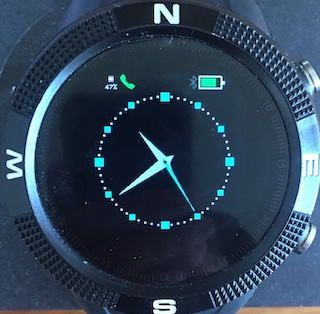
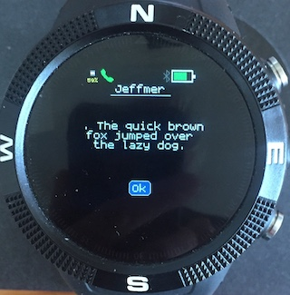
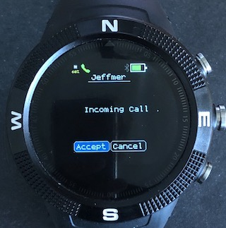
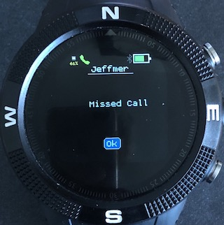

## iPhone notifications for Bangle.js - Version for modified firmware

This widget allows you to answer or cancel iPhone incoming calls and also displays messages and notifications. It connects to the Apple Notification Center Service which is already on all iPhones, so you do not need to install any additional iPhone apps to use this widget.

**Warning** - this is very much a beta release and although so far it appears quite stable, you may get the odd crash when moving between apps which will require a reboot - pressing BTN1 & BTN2 for 6 seconds. See issues at the end of this file.



### Installation
*First,you must update to the special modified Bangle firmware which you can find in this directory.*

This beta version can be installed from this [repository's](https://github.com/jeffmer/JeffsBangleAppsDev) app loader - [https://jeffmer.github.io/JeffsBangleAppsDev/](https://jeffmer.github.io/JeffsBangleAppsDev/). The widget will only run with a compatible clock app - see below. There are three listed in the App loader so install one or all three as they are linked and pressing BTN1 or BTN3 if they are not all installed will cause a black screen of death. Once installed, the widget will only appear in a compatible app when enabled in the Bangle Settings app - `ANCS Widget` will appear in `APP/Widget settings`. There is also a menu in these settings to let you configure the categories of notifications that you want to be displayed. 

### iPhone Pairing
Once enabled, the widget icon should be displayed coloured grey (its green in the photo). Go to the phone's Bluetooth settings menu and your Bangle should appear under Other devices. If this is the first time you have connected with the Bangle from your iPhone, it may be named Accessory. Click on the name and the iPhone should connect and start pairing. The widget icon will turn red and the iPhone will ask you to enter a pairing code - the traditional 123456. After that, the iPhone may also ask to allow the device access to ANCS. Once pairing is complete, the widget icon should go blue and eventually green.  The range of colours is:

* **Grey** - not connected - advertising
* **Red** - connected - not paired.
* **Blue** - paired and connected - getting services
* **Yellow** - got Services - discarding old notifications.
* **Green** - waiting for new notifications - calls and messages only in this implementation.

After pairing the first time, the Bangle should connect automatically when the widget is running. Sometimes you may need you to click on the Bangle name in `Settings:Bluetooth:My devices` on the iPhone or disable and then enable Bluetooth to start connection. You may also need to get the iPhone to forget the bond if you want to connect the App Loader or Web IDE.



### Messages & Calls
Messages are displayed as shown above until BTN2 is pressed to dismiss it. I strongly advise disabling the BTN2 LCD wake function in the Settings App as otherwise when the screen times out and you press BTN2 to wake the LCD, the screen will turn on and the Message Alert will be dismissed!. Calls can be answered or dropped.

   


### Issues
1. With GadgetBridge, the Android phone has a Central-Client role with the Bangle as Peripheral-Server. With the ANCS widget there is the fairly unusual situation in which the Bangle is Peripheral-Client to the iPhone's Central-Server role. Firstly, since Espruino does not deal explicitly with Bangle as Peripheral-Client, we have adopted the bodge outlined in an earlier posting and immediately connect back to the iPhone after the iPhone initiates the connection due to its Central role. This usually works, however, sometimes and especially when phone and Bangle are quite far apart, the Bangle connects in Peripheral-Server mode and the widget cannot get the Peripheral-Client connection it needs. The symptom is that the Bluetooth widget goes blue indicating connection from Central and the ANCS widget icon is grey indicating it has no connection. This should be fixed when Gordon deals with [Issue 1800.](https://github.com/espruino/Espruino/issues/1800) *Currently - the solution is to bring the Bangle near the phone and switch apps to force a reconnection attempt*.

2. When the Bangle switches apps, all state - including widget state - is lost unless explicitly stored. The consequence of this is that when the Bangle switches apps, the connection to iPhone has to be re-established to restore the remote GATT server and characteristics state. This is quite slow. To minimise reconnection, the widget needs to grab the screen from the running app to signal messages and calls. To allow this to work, the app needs to implement the `SCREENACCESS` interface. In essence, the widget only connects when running with compatible apps that implement this interface. An example and implement interface is:

```
var SCREENACCESS = {
      withApp:true,
      request:function(){
        this.withApp=false;
        stopdraw(); //clears redraw timers etc
        clearWatch(); //clears button handlers
      },
      release:function(){
        this.withApp=true;
        startdraw(); //redraw app screen, restart timers etc
        setButtons(); //install button event handlers
      }
}

Bangle.on('lcdPower',function(on) {
  if (!SCREENACCESS.withApp) return;
  if (on) {
    startdraw();
  } else {
    stopdraw();
  }
});
```
I would be very interested in a less instrusive way of doing this, however, the solutions for full screen alerts that I have seen involve switching apps. 
